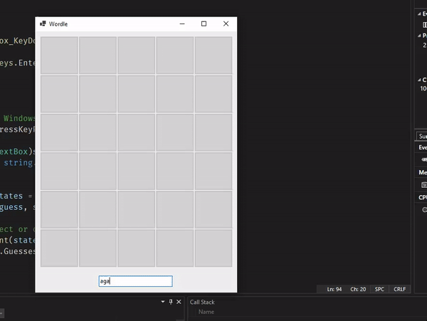
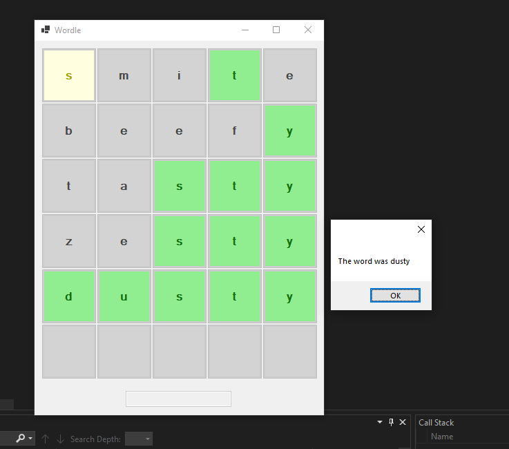
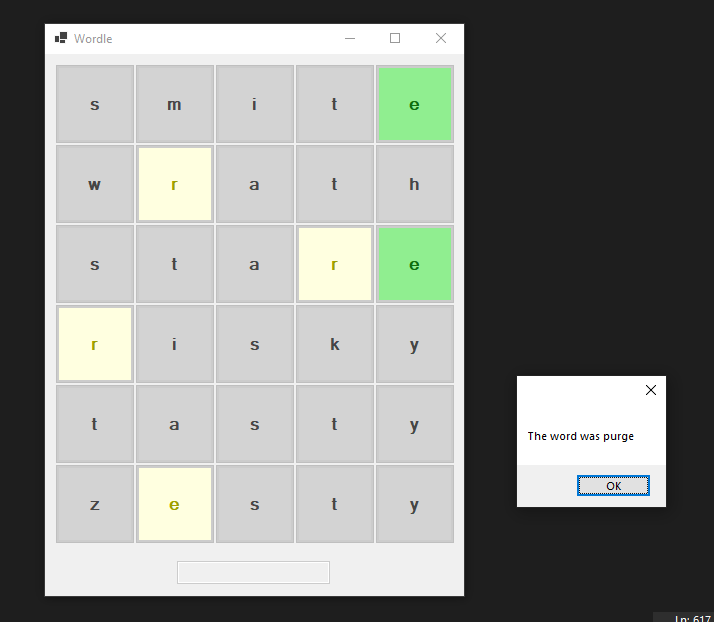

# WordleApp
Small project to conclude event-driven programming topic.

-----

## Evaluation

### Is the code working as intended?
Yes

### Can you get back to your code and understand it?
Probably, most of my code is fairly self-documenting and I added comments where necessary. The most confusing part of this project is the hierarchy of the xUnit library, since I implemented it by using dodgy inheritance techniques, accompanied with collections, mocking and fixtures (contexts).

### Should the code be refactored? Have you applied DRY? Separation of concerns?
Given the small number of files used, I think the code is best left with as many classes as there currently are. If I were to expand the interface I probably would refactor it to use a more practical architectural pattern like MVC or MVVM.
I separated the logic from the interface, so I believe I applied DRY. It's hard to apply clearly the other SOLID principles because of the small size of the project; I made an effort to apply the Single Responsiblity Principle, although I am uncertain if it was done, since my WordleLib classes felt slightly bloated at times.

### Have you commented it? Are the names of the components/variables meaningful?
Where it is necessary I commented my code, although I reckon most of my code is fairly self-documenting -- especially the tests, which have purposefully really long names. I didn't add any function documentation because I thought it was unnecessary.

### What would you do if you had to start over?
I would create the frontend using a genuine architectural pattern for the front-end.

### What have you learned?
My focus in this project was the logic and the unit testing, therefore I chiefly developed my understanding of unit testing. However, I also practiced applying basic design patterns. During my research about how to solve certain problems (and from the videos I watched to replace the TDD workshop) I learned about many interesting concepts such as fixtures to have multiple tests sharing a concept, and collections to make sure code runs sequentially rather than parallel.

**NOTE:** I implemented factory pattern for the creation of wordle games with set parameters, which reinforces the Single responsiblity principle
**NOTE:** some tests needed to run sequentially because in my unit tests I had a dictionary.txt file with a long list of all the words in play for the wordle. If they ran concurrently, I would get a permission denied error since multiple test objects would try to open the same file, and all my tests would fail.

## Screenshots

